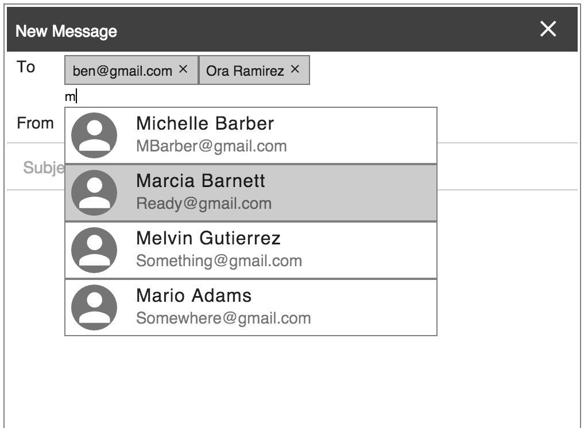

# SendTo

SendTo is a simple application emulating a "TO" line in a mail application. This project is mainly to learn Angular 2 and apply it to a project.

# Install

- npm install typings -g
- npm install
- npm start
